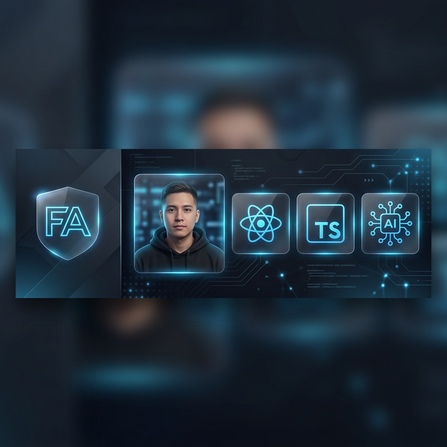

  

<h1 align="center">Franquer Abanto</h1>

  <em>Software Engineer &nbsp;·&nbsp; Frontend Specialist &nbsp;·&nbsp; AI Content Creator</em>

  
  &nbsp;&nbsp;&nbsp;&nbsp;&nbsp;
  
  &nbsp;&nbsp;&nbsp;&nbsp;&nbsp;
  

 

## 👨‍💻 Sobre Mí

> *"Si puedes imaginarlo, puedes codearlo."* 🚀

Programar es lo más parecido que tenemos a la **magia en el mundo real**. Mi misión es construir experiencias que otros solo pueden imaginar, convirtiendo la tecnología en mi superpoder.

- 📍 &nbsp;Lima, Perú
- 🎯 &nbsp;Especializado en **React**, **Next.js** y **TypeScript**
- 🤖 &nbsp;Creador de contenido sobre **IA** y desarrollo web
- 📺 &nbsp;Comparto mi journey en [YouTube](https://www.youtube.com/@abantofrank12)
- 🌱 &nbsp;Eterno estudiante — siempre aprendiendo algo nuevo

 

 

## 🚀 Proyectos Destacados

Actualización automática inteligente ✨

<!-- PROJECTS:START -->
<table border="0" width="100%" cellpadding="0" cellspacing="15">
<tr>
<td width="33.33%" align="center" valign="top">

  
   
  <h4 align="center" style="margin: 5px 0;">Frankusqabant</h4>
  
   
  

    <small>This is my personal repo for README</small>
  

  

  

  
&nbsp;&nbsp;

</td>
<td width="33.33%" align="center" valign="top">

  
   
  <h4 align="center" style="margin: 5px 0;">Simple Yoga Elite</h4>
  
   
  

    <small>Santuario de Yoga Elite - Protocolo Aurora v15.0. Experie...</small>
  

  

  

  
&nbsp;&nbsp;

</td>
<td width="33.33%" align="center" valign="top">

  
   
  <h4 align="center" style="margin: 5px 0;">Expense Tracker Ocr</h4>
  
   
  

    <small>Sin descripción del proyecto.</small>
  

  

  

  

</td>
</tr>
<tr>
<td width="33.33%" align="center" valign="top">

  
   
  <h4 align="center" style="margin: 5px 0;">Document Student</h4>
  
   
  

    <small>Sin descripción del proyecto.</small>
  

  

  

  
&nbsp;&nbsp;

</td>
<td width="33.33%" align="center" valign="top">

  
   
  <h4 align="center" style="margin: 5px 0;">Predictordepartidos</h4>
  
   
  

    <small>Sin descripción del proyecto.</small>
  

  

  

  
&nbsp;&nbsp;

</td>
<td width="33.33%" align="center" valign="top">

  
   
  <h4 align="center" style="margin: 5px 0;">Proyecto Curso Html</h4>
  
   
  

    <small>Sin descripción del proyecto.</small>
  

  

  

  
&nbsp;&nbsp;

</td>
</tr>
</table>
<!-- PROJECTS:END -->

 

 

## 📺 Últimos Videos en YouTube

<!-- YOUTUBE:START -->
<table border="0" width="100%" cellpadding="10" cellspacing="0">
<tr>
<td align="center" colspan="3">
 

  

  
<strong>¡Próximamente contenido en YouTube!</strong>
  
Estaré subiendo videos sobre desarrollo web, IA y mucho más.
 
¡Suscríbete para no perderte nada!
  

  
</td>
</tr>
</table>
<!-- YOUTUBE:END -->

 

 

## 🛠️ Tecnologías

<!-- LANGUAGES:START -->
<table border="0" width="100%" cellpadding="0" cellspacing="15">
<tr>
<td width="33.33%" valign="top">
  

    
    

      
<strong>🎨 FRONTEND</strong>

      
    

  

</td>
<td width="33.33%" valign="top">
  

    
    

      
<strong>⚙️ BACKEND</strong>

      
    

  

</td>
<td width="33.33%" valign="top">
  

    
    

      
<strong>🛠️ TOOLS</strong>

      
    

  

</td>
</tr>
</table>
<!-- LANGUAGES:END -->

 

 

## 📊 Estadísticas de GitHub

  
  &nbsp;&nbsp;
  

  

  

 

  

  Hecho con ❤️ y mucho código por <strong>Frank Abanto</strong>
   
  

