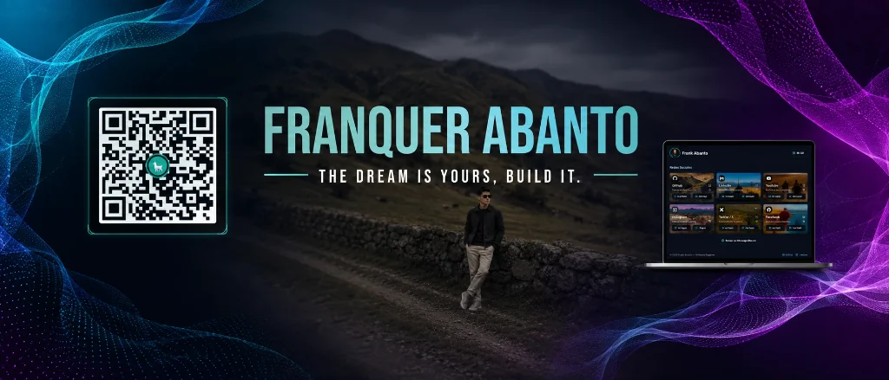
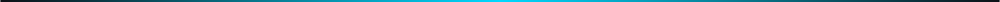
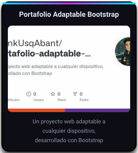
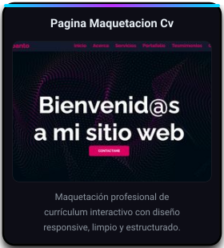
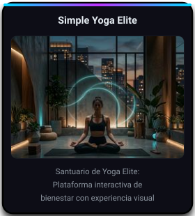
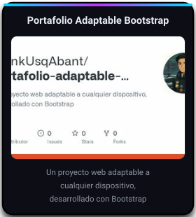
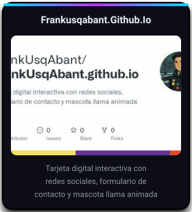
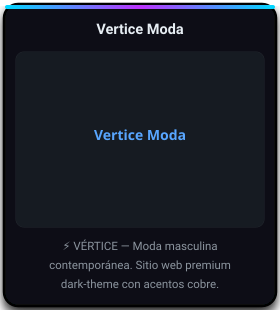

  

  

  &nbsp;&nbsp;&nbsp;&nbsp;&nbsp;&nbsp;&nbsp;&nbsp;&nbsp;&nbsp;



 

## 👨‍💻 Sobre Mí

  

 

 

## 🚀 Proyectos Destacados

<!-- PROJECTS:START -->
<table border="0" width="100%" cellpadding="0" cellspacing="15">
<tr>
<td width="33.33%" align="center" valign="top">
  <a href="https://frankusqabant.github.io/portafolio-adaptable-bootstrap/" target="_blank">
    
  </a>
  

    &nbsp;&nbsp;
  

</td>
<td width="33.33%" align="center" valign="top">
  <a href="https://frankusqabant.github.io/aurea-dental/" target="_blank">
    
  </a>
  

    &nbsp;&nbsp;
  

</td>
<td width="33.33%" align="center" valign="top">
  <a href="https://frankusqabant.github.io/Proyecto-Library/" target="_blank">
    
  </a>
  

    &nbsp;&nbsp;
  

</td>
</tr>
<tr>
<td width="33.33%" align="center" valign="top">
  <a href="https://frankusqabant.github.io/vertice-moda/" target="_blank">
    
  </a>
  

    &nbsp;&nbsp;
  

</td>
<td width="33.33%" align="center" valign="top">
  <a href="https://frankusqabant.github.io/02-contador-de-clics/" target="_blank">
    
  </a>
  

    &nbsp;&nbsp;
  

</td>
<td width="33.33%" align="center" valign="top">
  <a href="https://frankusqabant.github.io/01-testimonios/" target="_blank">
    
  </a>
  

    &nbsp;&nbsp;
  

</td>
</tr>
</table>
<!-- PROJECTS:END -->

 

 

## 📺 Últimos Videos en YouTube

<!-- YOUTUBE:START -->
<table border="0" width="100%" cellpadding="10" cellspacing="0">
<tr>
<td align="center" colspan="3">
 

  

  
<strong>¡Próximamente contenido en YouTube!</strong>
  
Estaré subiendo videos sobre desarrollo web, IA y mucho más.
 
¡Suscríbete para no perderte nada!
  

  
</td>
</tr>
</table>
<!-- YOUTUBE:END -->

 

 

## 🛠️ Tecnologías

<!-- LANGUAGES:START -->

  

    
    

      
    

  

<!-- LANGUAGES:END -->

 

 

## 📊 Estadísticas de GitHub

&nbsp;&nbsp;



 

<!-- Botón Volver Arriba -->

  

 

  

  Crafted with ⚡ and passion by <strong>Franquer Abanto</strong>
    
  

