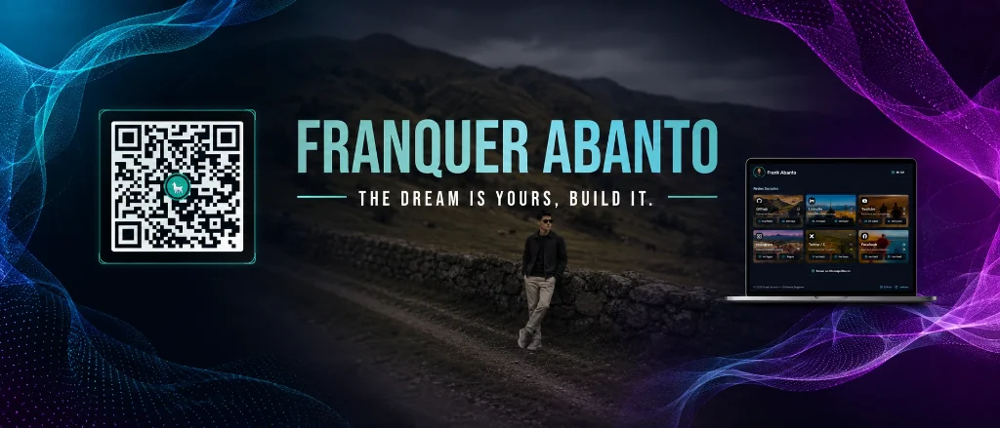
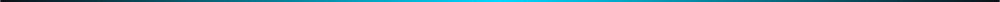

  

  

  &nbsp;&nbsp;&nbsp;&nbsp;&nbsp;&nbsp;&nbsp;&nbsp;&nbsp;&nbsp;

 

## 👨‍💻 Sobre Mí

  

 

 

## 🚀 Proyectos Destacados

<!-- PROJECTS:START -->
<table border="0" width="100%" cellpadding="0" cellspacing="10" style="table-layout: fixed; width: 100%;">
<tr>
<td width="33.33%" align="center" valign="top" style="word-break: break-word;">
  
  

    <strong>Opengravity</strong>
  

  

    OpenGravity proyecto de un bot para telegram
  

  

    &nbsp;&nbsp;
  

</td>
<td width="33.33%" align="center" valign="top" style="word-break: break-word;">
  
  

    <strong>Kasa Nord</strong>
  

  

    Kasa Nord — landing de inmobiliaria de lujo en Lima. HTML/CSS/JS planos, sin build.
  

  

    &nbsp;&nbsp;
  

</td>
<td width="33.33%" align="center" valign="top" style="word-break: break-word;">
  
  

    <strong>Extracto</strong>
  

  

    Extractor y Clasificador Inteligente de Facturas, Recibos y Contratos...
  

  

    &nbsp;&nbsp;
  

</td>
</tr>
<tr>
<td width="33.33%" align="center" valign="top" style="word-break: break-word;">
  
  

    <strong>Proyecto Curso Html</strong>
  

  

    🐾 DevFauna Academy...
  

  

    &nbsp;&nbsp;
  

</td>
<td width="33.33%" align="center" valign="top" style="word-break: break-word;">
  
  

    <strong>Youttube Git</strong>
  

  

    Este es el repositorio de codigo de Git
  

  

    &nbsp;&nbsp;
  

</td>
<td width="33.33%" align="center" valign="top" style="word-break: break-word;">
  
  

    <strong>Youtube Git Main</strong>
  

  

    Domina Git, Terminal, Lógica e IA — Estilo Duolingo...
  

  

    &nbsp;&nbsp;
  

</td>
</tr>
</table>
<!-- PROJECTS:END -->

 

 

## 📺 Últimos Videos en YouTube

<!-- YOUTUBE:START -->
<table border="0" width="100%" cellpadding="10" cellspacing="0" style="table-layout: fixed; width: 100%;">
<tr>
<td align="center" colspan="3">
 

  

  
<strong>¡Próximamente contenido en YouTube!</strong>
  
Estaré subiendo videos sobre desarrollo web, IA y mucho más.
 
¡Suscríbete para no perderte nada!
  

  
</td>
</tr>
</table>
<!-- YOUTUBE:END -->

 

 

## 🛠️ Tecnologías

<!-- LANGUAGES:START -->

  

    
    

      
    

  

<!-- LANGUAGES:END -->

 

 

## 📊 Estadísticas de GitHub

&nbsp;&nbsp;

 

<!-- Botón Volver Arriba -->

  

 

  

  Crafted with ⚡ and passion by <strong>Franquer Abanto</strong>
    
  

